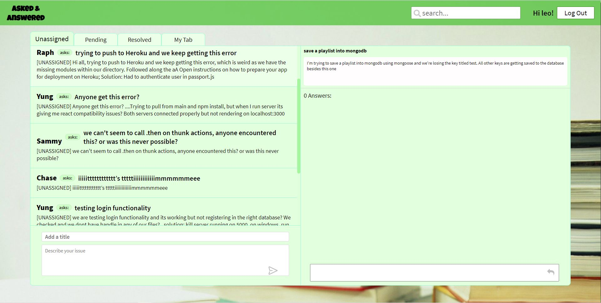
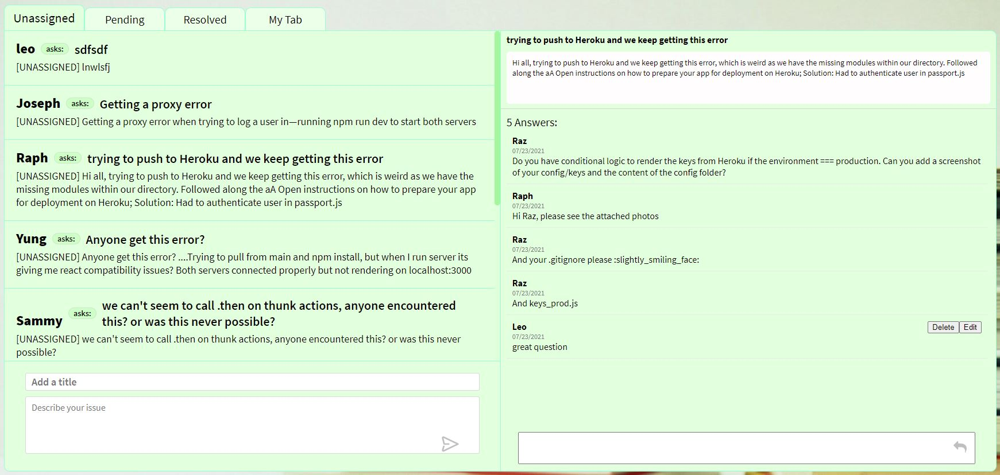
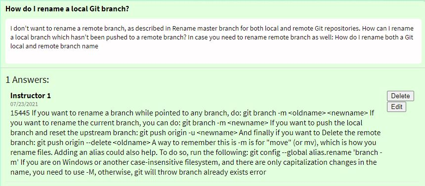
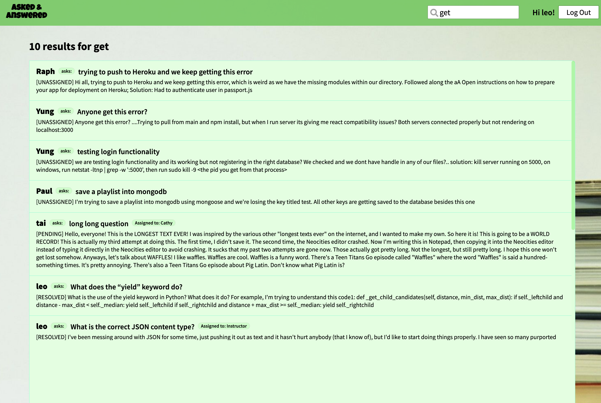

# 
 [Link to the Live Site!](https://asked-and-answered.herokuapp.com) 

# 

Asked & Answered is a platform to connect students with instructors for streamlining questions and answers. Built using the MERN stack (MongoDB, Express, React, Node), students can post questions/issues in the application. Instructors are primarily responsible for responding to and resolving questions. All users can view and contribute to questions. Users can search all previous questions and solutions.

## Splash/Landing page and User Auth

* Upon visting Asked and Answers, users have to sign in to gain access to the homepage.
* Users can choose to sign in as an Instructor or as a Student, each account has its own unique functionalities and privileges (In-dept details below in Questions & Answers sections)
* Only students will be able to sign up for new accounts, Instructor accounts are created by the admins (us developers)
* Login page validates and rendor error messages when recevied invalid credentials

## Questions
Under the questions route, both instructors and student users have access to tabs that filter questions by their status
* Unassigned - fetches all questions that have not yet been assigned by an instructor
* Pending - displays all questions that have been assigned, but not yet resolved
* Resolved - shows all resolved questions
* My Tab
  * for students this is a list of all questions they have submitted
  * for instructors this is a list of all questions they are assigned to

Clicking on a question splits the page with the questions gallery on the left and the selected question and associated answers on the right.

### Students
* can submit a question by entering a title and description and clicking the airplane icon.
* hover over a question to see additional functionality
* can edit and delete their own questions
* can mark their own questions as resolved

### Instructors
* can assign questions to themselves under the Unassigned tab

* once a questions has been assigned to the instructor, they can
  * unassign the question
  * mark question as resolved

## Answers
Clicking on a question displays all the answers/replies associated with the question
* users can post an answer to a question
* users can edit or delete their own answer

## Search

Users can search for questions based off of content contained from the question title or the question body.

This photo displays the search results after searching for the term "get". As you can see the search functionality looks for content contained in the title as well as in the body of each question for a match.

To accomplish this we created custom logic that filters content based off of the input from the user. We established a frontend route for a search which takes in a query from the user input. We then take the user input and create a query that filters through questions finding those that match by keywords. We then return the list of questions that meet this criteria.

# The A(&A) TEAM

### Sammy Huang (Team Lead)
* [LinkedIn](https://www.linkedin.com/in/sammy-huang)
* [GitHub](https://github.com/huangs2022672)
* [AngelList](https://angel.co/u/sammy-huang-3)

### Ariel Davies (Frontend Developer)
* [LinkedIn](https://www.linkedin.com/in/ariel-davies-84456a113)
* [GitHub](https://github.com/ariellio)
* [AngelList](https://angel.co/u/ariel-davies)

### Tai Huynh (Backend Developer)
* [LinkedIn](https://www.linkedin.com/in/tai-huynh-35934664)
* [GitHub](https://github.com/taihuynh812)
* [AngelList]()

### Leo Cao (Flex Developer)
* [LinkedIn](https://www.linkedin.com/in/leocho1989)
* [GitHub](https://github.com/leocho1989)
* [AngelList](https://angel.co/u/leo-cao-1)
